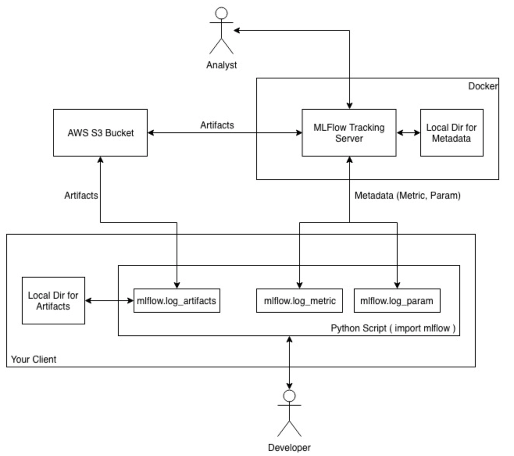

# C++ version of MLflow + Dockerization of coding environment + S3 capability

MLflow is an open source platform to manage the ML lifecycle, including experimentation, reproducibility and deployment.
This repository added the C++ version of Mlflow. Also added Dockerization of coding environment and S3 capabilities. 

## Documentation of MLflow

Official documentation for MLflow can be found at https://mlflow.org/docs/latest/index.html.

The Github page, https://github.com/mlflow/mlflow/

## How to install

### Server

Open a aws machine which the Security Group is "all_port". SSH to the machine.

  1- Build a docker:
 
     1- Have the file ecopia-zebra/mlflow-0.7/docker-mlflow/Dockerfile in your machine
     
       **Note:** In order to change the s3 address for saving artifacts, change the mlflow-0.7/docker-mlflow/Dockerfile --default-artifact-root s3://your-bucket/
    
     2- docker build -t mlflow-server .
    
     3- docker run -p 5000:5000 mlflow-server

  2- In another terminal run "docker ps" to get CONTAINER_ID. Then run: docker cp  ~/.aws/  CONTAINER_ID:/root/
  

  

### Client

Inside your machine, have a docker and install all the requirement libraries to run your code. Also, make sure to have mlflow-0.7.

Build a docker:
  
  Have a Dockerfile for client.
  
  1- docker build -t mlflow-client .
  
  2- docker run -e FUTURE_CONTAINER_NAME="mlflow-client-v0" -it mlflow-client bash
  
  **Note:** Environment variable FUTURE_CONTAINER_NAME will be used in docker.

Run any Python/C++ code using command: 

  MLFLOW_TRACKING_URI=http://aws-machine-public-ip:5000 python my-script.py
 
  MLFLOW_TRACKING_URI=http://aws-machine-public-ip:5000 ./my-script (c++)

### Running a Sample App With the Tracking API

The programs in ``examples`` use the MLflow Tracking API. For instance, run::

    python examples/quickstart/mlflow_tracking.py

This program will use `MLflow Tracking API <https://mlflow.org/docs/latest/tracking.html>`_,
which logs tracking data in ``./mlruns``. This can then be viewed with the Tracking UI.

### APIs:

**Python:**

Checkout example file at mlflow-0.7/examples/quickstart/mlflow_tracking.py 

For complete APIs checkout https://mlflow.org/docs/latest/python_api/index.html

**C++:**

Checkout example file at mlflow-0.7/mlflow/cpp/test/mlflow_ex.cpp

## Basic logging functions

**Python:**

create_experiment() creates a new experiment and returns its ID. Runs can be launched under the experiment by passing the experiment ID to mlflow.start_run.

set_experiment() sets an experiment as active. If the experiment does not exist, creates a new experiment. If you do not specify an experiment in mlflow.start_run(), new runs are launched under this experiment.

create_run() creates a run.

start_run() returns the currently active run (if one exists), or starts a new run and returns a mlflow.ActiveRun object usable as a context manager for the current run. You do not need to call start_run explicitly: calling one of the logging functions with no active run will automatically start a new one.

end_run() ends the currently active run, if any, taking an optional run status.

active_run() returns a mlflow.entities.Run object corresponding to the currently active run, if any.

log_param() logs a key-value parameter in the currently active run. The keys and values are both strings.

log_metric() logs a key-value metric. The value must always be a number. MLflow will remember the history of values for each metric.

log_artifact() logs a local file as an artifact, optionally taking an artifact_path to place it in within the run’s artifact URI. Run artifacts can be organized into directories, so you can place the artifact in a directory this way.

log_artifacts() logs all the files in a given directory as artifacts, again taking an optional artifact_path.

log_message() logs a message into web ui.

log_author() logs the author into web ui.

log_docker_id() logs the docker id of the current docker you are working.

log_docker_image_name() logs the name of the future committed current docker image. The name that you will give to this current image, when you want to commit it. 

get_artifact_uri() returns the URI that artifacts from the current run should be logged to.

set_tag() sets a tag in key, value form.

compelete mlflow python api: https://mlflow.org/docs/latest/python_api/index.html

**C++:**

createRun() creates a run. 

logParam() logs a key-value parameter in the currently active run. The keys and values are both strings.

logMetric() logs a key-value metric. The value must always be a number. MLflow will remember the history of values for each metric.

logArtifact() logs a local file as an artifact, optionally taking an artifact_path to place it in within the run’s artifact URI. Run artifacts can be organized into directories, so you can place the artifact in a directory this way.

logMessage() logs a message into web ui.

logAuthor() logs the author into web ui.

logDockerId() logs the docker id of the current docker you are working.

logDockerImageName() logs the name of the future committed current docker image. The name that you will give to this current image, when you want to commit it.

setTag() sets a tag in key, value form.

**Note:** 
 
  For creating an experiment in c++, use comand-line command:

    MLFLOW_TRACKING_URI=server_url:5000 python ecopia-zebra/mlflow-0.7/mlflow/cli.py experiments create name_of_experiment 
  
  For Listing the created experiments, to get an experiment's id, name, and artifact location:
    
    MLFLOW_TRACKING_URI=server_url:5000 python ecopia-zebra/mlflow-0.7/mlflow/cli.py experiments list
    
